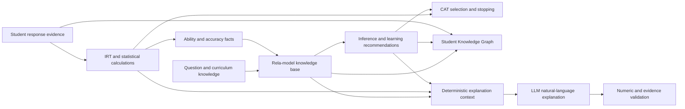

# Knowledge Representation, Problems, and Algorithms

## 1. Purpose and scope

This document explains the intellectual mechanism of the Adaptive Ability Assessment system. It focuses on what knowledge the system represents, which problems it solves, how its algorithms work, and why those algorithms were chosen. It intentionally does not describe web pages, endpoints, containers, or source-code organization.

The system is a hybrid knowledge-based system. Its central principle is:

> Numerical models calculate evidence; the symbolic knowledge base interprets that evidence; deterministic policies make operational decisions; the LLM may express or propose content but is never the final authority.

The implemented mechanisms are divided into four layers:

1. **Rela-model knowledge base:** concepts, relations, asserted facts, inferred facts, and explicit rules.
2. **Mathematical assessment:** IRT 3PL, EAP ability estimation, Fisher information, and empirical item diagnostics.
3. **Decision algorithms:** constrained fixed-exam selection, CAT question selection and stopping, and rule-derived learning recommendations.
4. **Supporting intelligence:** Knowledge Graph construction, governed LLM question drafting, and grounded Vietnamese explanations.

Deep Knowledge Tracing (DKT) and Reinforcement Learning (RL) are not implemented and are not claimed in this document.

## 2. Knowledge-engineering design process

The course model describes a knowledge-based system as a system that receives a problem, translates it into an internal knowledge representation, uses an inference mechanism, and returns a result that can be explained. The four design stages from the course are applied as follows [*2a. Các quy trình trong Thiết kế hệ CSTT*, pp. 4, 6–11; *3. Các quy trình trong Thiết kế hệ CSTT*, pp. 5–8].

| Stage | Applied mechanism |
| --- | --- |
| Knowledge acquisition | Collect subjects, topics, skills, prerequisites, questions, Bloom levels, answers, explanations, IRT parameters, average response time, response histories, and learning-path knowledge. |
| Knowledge-base design | Represent the domain using Rela-model `K = (C, R, Rules)`. Keep concepts, relations, facts, and rules explicit and separately manageable. |
| Inference-engine design | Normalize facts, unify variables, compute relation and rule closure, restrict reasoning toward a goal, reduce traces, and connect numerical results back to symbolic facts. |
| Explanation design | Present scores and learning guidance in human terms while retaining technical evidence and provenance for authorized reviewers. |

The design separates four ideas that are often incorrectly combined:

- The **knowledge base** stores what is known.
- The **inference engine** derives new symbolic knowledge.
- The **mathematical modules** calculate probabilities, ability, information, and calibration statistics.
- The **LLM** generates a draft or wording from already bounded context.

An IRT formula is therefore not itself a symbolic rule. It is a computational relation whose result becomes a fact that rules can interpret. Likewise, the Knowledge Graph is a connected view of knowledge; it does not replace the Rela-model or inference engine.

## 3. Overall reasoning architecture



This flow has two feedback loops:

1. A response changes the current evidence and ability estimate, which changes the next CAT choice.
2. Completed response history changes unit-level evidence, which changes inferred recommendations and the next assessment emphasis.

## 4. Rela-model knowledge representation

### 4.1 Formal definition

The knowledge base follows the relational knowledge model:

```text
K = (C, R, Rules)
```

- `C` is the set of domain concepts.
- `R` is the set of typed binary relations between concepts.
- `Rules` is the set of transformations from hypothesis facts to goal facts.

This is based on the course Rela-model definition and its levels `C(0)`–`C(3)` [*6b. Cấu trúc tri thức quan hệ*, pp. 2–4].

### 4.2 Concept hierarchy `C(0)`–`C(3)`

| Level | Meaning | Concepts in this system |
| --- | --- | --- |
| `C(0)` | Primitive value domains | Number, text, Boolean, probability, theta, duration, timestamp |
| `C(1)` | Simple identifiable domain objects | Subject, Topic, Skill, Bloom Level, Student, Response Event |
| `C(2)` | Structured objects composed from lower concepts | Question, IRT Item, Ability State, Exam Blueprint, Learning Path |
| `C(3)` | Higher-level objects aggregating histories and relationships | Exam Session, Adaptive Learning Profile, Explainable Assessment, Student Knowledge Graph |

The levels are semantic levels rather than database depth. A `Question`, for example, is `C(2)` because it combines content, answer structure, knowledge-unit links, Bloom classification, timing, provenance, and IRT properties.

### 4.3 Main concept semantics

#### Subject

A subject defines an assessment domain such as Database Systems or Computer Networks. It provides the top-level boundary for fixed exams, CAT sessions, abilities, and learning paths.

#### Topic and Skill

A topic identifies a content area. A skill identifies an assessable capability within or across a topic. Both are represented as knowledge units so that they can share prerequisite, measurement, ability, and recommendation relations.

#### Bloom Level

The operational bank uses five cognitive levels:

```text
remember < understand < apply < analyze < evaluate
```

Bloom level describes the expected cognitive operation. It contributes to authoring, review, time estimates, and the initial IRT rubric, but it is not treated as identical to empirical difficulty.

#### Question and IRT Item

A question carries the assessment content and knowledge mapping. Its IRT item component carries:

- `a`: discrimination;
- `b`: difficulty location on the ability scale;
- `c`: lower-asymptote or guessing probability;
- normalized difficulty and a human difficulty label;
- expected response time and calibration status.

#### Ability State

An ability state describes the current estimate for a student at subject or knowledge-unit scope:

```text
(student, subject, optional unit, theta, standard error, mastery transform, evidence count)
```

It is not a permanent student trait. It is recomputed from accumulated response evidence and therefore changes over time.

#### Response Event

A response event is the primary learning evidence. It records what item was answered, the selected answer, correctness, awarded score, response time, and the ability state surrounding the response.

#### Exam Blueprint

A blueprint is a constraint object. It can specify subject, question count, difficulty proportions, topics, skills, Bloom levels, and maximum estimated duration.

#### Learning Path

A learning path is a set of recommended actions over knowledge units, supported by response evidence, prerequisite structure, and inference provenance. It is not merely a manually ordered list.

### 4.4 Relation set `R`

| Relation | Domain → range | Meaning and property |
| --- | --- | --- |
| `belongs to subject` | Question/Knowledge Unit → Subject | Directed classification relation |
| `measures` | Question → Topic/Skill | Many-to-many measurement relation |
| `prerequisite of` | Topic/Skill → Topic/Skill | Directed and transitively expandable |
| `has Bloom level` | Question → Bloom Level | Cognitive classification |
| `answered` | Response Evidence → Question | Connects observed performance to an item |
| `produced evidence` | Student → Response Evidence | Establishes evidence ownership |
| `has ability` | Student → Subject/Topic/Skill | Connects a student to an evolving ability state |
| `supports ability` | Response Evidence → Topic/Skill | States what unit an answer informs |
| `weak unit` | Student → Topic/Skill | Inferred remediation state |
| `recommended next` | Student → Subject/Topic/Skill | Directed learning recommendation |
| `similar to` | Question ↔ Question | Symmetric duplicate-risk relation when enabled |

Symmetric and transitive behavior is metadata-driven. A relation is not automatically symmetric merely because its name resembles equality; its declared relation semantics determine canonicalization and expansion.

### 4.5 Five fact forms

The inference system supports the five Rela-model fact categories:

| Fact type | Abstract form | Example |
| --- | --- | --- |
| Type fact | `x : c` | `DB-EN-001 : Question` |
| Determined object | `o` | `Question(DB-EN-001)` exists |
| Constant assignment | `o.attr = constant` | `difficulty(DB-EN-001, 0.82)` |
| Equality | `x = y` | `difficulty label(DB-EN-001) = hard` |
| Binary relation | `x Φ y` | `DB-EN-001 measures SQL Join` |

The stored representation is canonical and supports any argument count even though binary relations are the central course form. This permits facts such as:

```text
unit accuracy(Student 1, SQL Join, 0.40)
recommended next(Student 1, SQL Join, remediate)
has IRT parameters(DB-EN-001, 1.30, 0.80, 0.20)
```

Every fact can retain confidence, source, creation information, and provenance. Asserted facts record observed or authored knowledge. Inferred facts additionally record the rule and evidence facts that produced them.

### 4.6 Fact identity and normalization

A fact identity is formed from:

```text
(fact type, predicate, canonical arguments)
```

Values are serialized in a stable representation, including sorted object keys. For a declared symmetric relation, the two arguments are sorted before the identity is calculated. This gives three important properties:

1. The same fact cannot be added repeatedly.
2. Symmetric duplicates such as `similar(A,B)` and `similar(B,A)` collapse to one fact.
3. Cyclic rules reach a fixed point instead of generating an infinite sequence of duplicates.

## 5. Rules and inference

### 5.1 Rule structure

Each rule has:

```text
(code, name, hypothesis, goals, priority, weight, explanation, source)
```

The hypothesis contains fact patterns and optional comparisons. The goals contain fact templates to instantiate after variables are unified.

Representative executable rules include:

| Rule | Hypothesis | Derived knowledge |
| --- | --- | --- |
| Classify hard question | `difficulty norm(q,v)` and `v ≥ 0.80` | `classified as(q, hard)` |
| Remediate weak unit | `unit accuracy(s,u,v)` and `v < 0.50` | `weak unit(s,u)` and `recommended next(s,u,remediate)` |
| Reinforce developing unit | `0.50 ≤ unit accuracy(s,u,v) < 0.75` | `recommended next(s,u,reinforce)` |
| Advance mastered unit | `unit accuracy(s,u,v) ≥ 0.75` | `has mastery(s,u,true)` and `recommended next(s,u,advance)` |
| Increase weak-unit frequency | `weak unit(s,u)` | `topic weight(s,u,increased)` |
| Score selected option | selected option and its score weight are known | awarded score fact |
| Generate valid option set | question is ready and best option is known | displayed options must include the best option |
| Record updated ability | binary response, IRT parameters, and computed theta are known | updated theta fact |

Thresholds and rule definitions are external knowledge, not conditions hidden inside the inference engine.

### 5.2 Variable unification

Variables start with `?`. Consider:

```text
unit accuracy(?student, ?unit, ?value)
?value < 0.50
```

Given:

```text
unit accuracy(Student 1, SQL Join, 0.40)
```

unification produces:

```text
?student = Student 1
?unit    = SQL Join
?value   = 0.40
```

The comparison succeeds, so the rule goals become:

```text
weak unit(Student 1, SQL Join)
recommended next(Student 1, SQL Join, remediate)
```

Supported comparisons are equality, inequality, less than, less than or equal, greater than, and greater than or equal. An unbound comparison does not succeed.

### 5.3 Forward closure

Let `F₀` be the normalized initial facts. Forward reasoning computes a closure:

```text
F₀ ⊆ F₁ ⊆ F₂ ⊆ ... ⊆ Closure(F₀)
```

At each iteration, every applicable rule is matched against known facts. New goal facts are instantiated, deduplicated, assigned provenance, and added to the known set. Transitive relations are expanded when new edges appear.

Conceptual algorithm:

```text
Known := normalize(initial facts)
expand transitive relations

repeat:
    changed := false
    for rule in order(priority, weight, code):
        for each consistent variable binding:
            if every comparison succeeds:
                instantiate the rule goals
                add every unseen fact with provenance
                record a trace step
                expand transitive relations
                changed := true if anything was added
until goal is reached, no fact changes, or a safety bound is reached
```

The implemented safety bounds are 100 rule iterations and 10,000 facts per inference request. Duplicate prevention is the main termination guarantee for finite fact/rule sets; the bounds protect against unexpectedly explosive knowledge.

This realizes `Obj.Closure(F)` from the Rela-model theory [*6b. Cấu trúc tri thức quan hệ*, pp. 5–7].

### 5.4 Relation closure

For a transitive relation such as prerequisites:

```text
A prerequisite of B
B prerequisite of C
```

the engine derives:

```text
A prerequisite of C
```

The inferred edge stores both input edge identifiers and a synthetic transitivity rule identifier. This preserves an explanation path rather than silently adding an edge.

### 5.5 Backward and hybrid reasoning

The implemented backward strategy is a goal-directed dependency restriction:

1. Start from the desired goal predicate.
2. Select rules that can produce that predicate.
3. Add the predicates required by those rules to the needed set.
4. Repeat until no additional producer rules are found.
5. Run forward matching using only this relevant rule slice.

This is deliberately not a recursive Prolog-style proof search. It provides the main benefit required here—ignoring unrelated rules—while reusing the tested forward unification mechanism.

Hybrid reasoning performs the broader closure and then walks backward through provenance from the solved goal. Only trace steps needed to produce the final goal remain in the reduced explanation. This corresponds to combining data-driven inference with goal-oriented solution reduction [*4a. Các chiến lược suy diễn*, pp. 3, 5].

### 5.6 Rule ordering and heuristic scope

Rules are ordered by:

```text
(ascending priority, ascending weight, rule code)
```

Goal relevance further reduces the search space in backward mode. This is a transparent heuristic, not a learned policy and not an A* optimizer. The project uses weighted greedy methods where they are easy to explain and verify; it does not claim optimal minimum-cost proof search.

### 5.7 Trace and provenance reduction

Each derivation step records:

- applied rule;
- evidence fact identifiers;
- produced fact identifiers;
- variable bindings;
- human explanation.

To reduce a trace, start with the solved goal fact and scan steps in reverse. Keep a step if it produced a currently needed fact; then add that step's input facts to the needed set. Reverse the retained steps to recover a minimal causal chain relative to the recorded derivation.

This makes the answer explainable in terms of actual evidence. It does not ask an LLM to invent why a recommendation was made.

## 6. General problem formulation

The project represents a reasoning problem as:

```text
(O, F) → G
```

- `O`: relevant domain objects;
- `F`: known facts and observations;
- `G`: desired goal object or fact.

A problem is solvable when a sequence of valid transformations produces a fact that unifies with `G` [*6b. Cấu trúc tri thức quan hệ*, p. 8].

For numerical subproblems, the project follows the computational-network view:

```text
(M, F_c)
```

- `M` contains numerical attributes such as theta, item parameters, probabilities, and standard errors.
- `F_c` contains deterministic computations such as 3PL probability, EAP estimation, and Fisher information.

The numerical result is returned to the symbolic layer as a fact. For example, IRT calculates `theta = 0.42`; the knowledge system can then store `computed theta(Student 1, 0.42)` and derive an updated ability state. This is the project’s practical interpretation of computational closure and weighted networks [*4b. Các chiến lược suy diễn (tt.)*, p. 3; *5a. Mạng tính toán*, pp. 4–5].

## 7. Problem 1 — Question-bank knowledge governance

### 7.1 Problem

```text
Input: authored or generated question bundle
Goal: determine whether the question is safe to enter the operational pool
```

The question bank is part of the knowledge base, so invalid metadata would corrupt both assessment and inference. Activation therefore requires deterministic validation.

### 7.2 Validation algorithm

A question is blocked when any of the following fails:

- structurally valid answer pool and exactly one best answer;
- valid option text and score weights;
- distinct answer options;
- non-empty explanation and source;
- non-empty provenance;
- exactly one topic and exactly one primary skill;
- no exact or high-overlap duplicate stem;
- `a > 0`, `-4 ≤ b ≤ 4`, and `0 ≤ c ≤ 0.5`;
- consistency between normalized difficulty and easy/medium/hard label.

Bloom/difficulty combinations such as a hard remember item or easy evaluate item produce warnings rather than automatic rejection because cognitive level and empirical difficulty are related but not identical.

Near-duplicate detection uses token-set Jaccard similarity:

```text
J(A,B) = |A ∩ B| / |A ∪ B|
```

A similarity of at least `0.85` is treated as a blocking near duplicate.

### 7.3 State transition

```text
Draft → Deterministic review → Reviewed → Explicit activation
```

Editing an item returns it to draft and invalidates the previous review. This prevents an approved item from being silently changed while retaining its approved state.

## 8. Problem 2 — Fixed-exam generation

### 8.1 Problem formulation

```text
O = {Blueprint, Question Bank, Student Ability, Subject, Topics, Skills}
F = {active-item facts, IRT parameters, knowledge mappings, requested constraints}
G = {an exam that satisfies the exact blueprint}
```

### 8.2 Hard filtering

Candidates must satisfy:

- operational status and answer validity;
- requested subject;
- optional topic, skill, and Bloom restrictions;
- requested difficulty quotas;
- optional estimated-duration bound.

The system does not clone, generate, or silently substitute questions when a blueprint is infeasible.

### 8.3 Difficulty quota allocation

For `N` questions and target proportion `p_d` for difficulty band `d`:

```text
raw_d   = N · max(0, p_d)
quota_d = floor(raw_d)
```

Remaining positions are assigned to bands with the largest fractional remainder until the quotas sum to `N`. The input distribution is expected to be valid and normalized before selection.

Example for `N = 10` and `(0.3, 0.4, 0.3)`:

```text
easy = 3, medium = 4, hard = 3
```

### 8.4 Candidate ranking

Within the required difficulty band, a candidate receives a ranking value based on:

```text
Fisher information at current theta
+ topic-diversity bonus
+ small seeded tie-breaking jitter
```

The topic bonus is:

```text
0.12 / (1 + previous use of the topic)
```

The random jitter is bounded and seeded, so a supplied seed makes the complete selection reproducible.

### 8.5 Duration feasibility

Before accepting a candidate, the algorithm estimates the minimum possible duration for all remaining quotas. A candidate is rejected if:

```text
elapsed time
+ candidate time
+ minimum time needed for every remaining quota
> maximum estimated duration
```

This look-ahead avoids a greedy early choice that would make the final blueprint impossible.

### 8.6 Result properties

- Exact count and difficulty quotas.
- No repeated question.
- Balanced topic use when alternatives exist.
- High measurement information around the student's current estimate.
- Reproducibility when a seed is supplied.
- Explicit failure when exact constraints cannot be satisfied.

## 9. Problem 3 — Scoring and ability estimation

### 9.1 Raw score and IRT evidence are different

The visible test score is the sum of option score weights:

```text
score = Σ awarded weight
percentage = 100 · score / maximum score
```

Ability estimation uses a binary response:

```text
u_i = 1 if the best answer was selected, otherwise 0
```

This separation permits partial-credit reporting without pretending that the current 3PL estimator is a polytomous IRT model.

### 9.2 IRT 3PL response model

For item `i` and student ability `θ`:

```text
P_i(θ) = c_i + (1-c_i) / (1 + exp(-D·a_i·(θ-b_i)))
D = 1.7
```

Interpretation:

- `a_i > 0`: how sharply the item distinguishes nearby ability levels;
- `b_i`: ability location at which the non-guessing part of success changes most rapidly;
- `c_i`: probability floor caused by guessing;
- `θ`: latent ability on the same scale as `b_i`.

Important behavior:

- Increasing `θ` increases success probability when `a_i > 0`.
- A larger `b_i` makes the item harder at the same `θ`.
- Probability approaches `c_i`, not zero, for very low ability.

### 9.3 EAP ability estimation

The system uses Expected A Posteriori estimation over a fixed theta grid:

```text
θ_k ∈ {-4.00, -3.95, ..., 3.95, 4.00}
```

For response vector `u`, the unnormalized posterior weight is:

```text
w_k = Normal(θ_k | μ₀, σ₀)
      · Π_i P_i(θ_k)^(u_i·m_i)
      · (1-P_i(θ_k))^((1-u_i)·m_i)
```

where `m_i` is a measurement weight. Subject-level estimation uses `m_i = 1`. Unit-level estimation can use the question-to-unit measurement weight.

The implementation evaluates this expression in log space to prevent numerical underflow:

```text
log w_k = -0.5((θ_k-μ₀)/σ₀)²
          + Σ_i m_i[u_i log P_i(θ_k) + (1-u_i)log(1-P_i(θ_k))]
```

After subtracting the maximum log weight and exponentiating:

```text
θ_hat = Σ_k θ_k w_k / Σ_k w_k

SE = sqrt(Σ_k w_k(θ_k-θ_hat)² / Σ_k w_k)
```

The reported standard error is therefore the posterior standard deviation produced by EAP. It is not calculated as `1/sqrt(total Fisher information)` in the current implementation.

### 9.4 Historical update

After an answer, CAT obtains an immediate within-session estimate. The durable subject and unit ability states are then recomputed from the full completed response ledger for that student and subject. This avoids making the latest test erase prior evidence.

The result includes:

- subject theta and posterior standard error;
- unit-specific theta and standard error;
- evidence count;
- a mastery transform.

The mastery value is a transparent logistic transformation:

```text
mastery(θ) = 1 / (1 + exp(-θ))
```

It is useful for ordering and display, but it should not be interpreted as a separately calibrated probability of curriculum mastery.

## 10. Problem 4 — Computerized Adaptive Testing

### 10.1 Problem formulation

```text
Input:
    current ability estimate,
    unanswered valid questions,
    unit mastery,
    target content distribution,
    question exposure,
    stopping configuration

Output:
    the most useful next question, or a justified stop decision
```

CAT is one-subject-per-session. It selects one question, receives one response, updates evidence, and repeats.

### 10.2 Fisher information

The information of a 3PL item is:

```text
I_i(θ) = D²a_i²(1-P_i(θ))(P_i(θ)-c_i)²
         / [P_i(θ)(1-c_i)²]
```

An item is generally informative near the ability range where its response curve is steep. High discrimination increases information, while extreme mismatch between item difficulty and current ability usually reduces it.

For combining information with bounded policy terms, the selector normalizes it as:

```text
information score = I_i(θ) / (1 + I_i(θ))
```

### 10.3 Weak-unit priority

For every knowledge unit measured by a candidate:

```text
weakness = 1 - mastery
```

The question's weak-unit score is the maximum weakness among its measured units. A question covering the student's weakest relevant unit therefore receives the strongest remediation bonus.

The symbolic rule `weak unit → increased topic weight` expresses the same knowledge policy. The operational selector realizes that policy numerically through the weak-unit score; it does not require an LLM or RL policy.

### 10.4 Content-balance score

Let `n` be the number of questions already used and `t_d` the target proportion for the candidate's difficulty band `d`:

```text
expected_d = t_d · (n + 1)
balance_d  = clip(expected_d - used_d, 0, 1)
```

An underrepresented difficulty band receives a positive bonus. An already satisfied or overrepresented band receives no bonus.

### 10.5 Exposure penalty

Let `e_i` be the historical exposure count of candidate `i` and `e_max` the maximum candidate exposure:

```text
exposure_i = e_i/e_max, if e_max > 0; otherwise 0
```

Frequently exposed questions are penalized. This reduces overuse and limits how predictable the adaptive pool becomes.

### 10.6 Composite selection function

The final selection score is:

```text
S_i = w_I · information_i
    + w_W · weak_unit_i
    + w_B · content_balance_i
    - w_E · exposure_i
```

Current default weights are:

```text
w_I = 1.00
w_W = 0.35
w_B = 0.20
w_E = 0.15
```

All weights are centrally configurable. The highest score is selected. Exact ties are broken by stable question code, making the policy deterministic for identical state.

### 10.7 No-repeat and concurrency guarantees

Previously used question identifiers are excluded before scoring. The currently presented item and session are locked during answer processing. A stale or repeated submission does not create a second response. These properties preserve the mathematical assumption that the response vector contains one observation per administered item.

### 10.8 Stopping algorithm

The stop conditions are evaluated in this order:

1. Stop when the maximum question count is reached.
2. Stop when no valid unused candidate remains.
3. Before the minimum count, continue regardless of estimated precision.
4. After the minimum, stop when posterior standard error is at or below the threshold.
5. Otherwise, stop when theta changes by at most `ε` for the configured consecutive window.

The current defaults include:

```text
minimum questions = 10
maximum questions = 30
SE threshold      = 0.30
stability epsilon = 0.05
stability window  = 3 changes
```

The estimated duration is advisory. Reaching zero on the countdown does not force submission or invalidate the session.

### 10.9 One CAT iteration

```text
1. Lock the current session and unanswered item.
2. Validate the submitted option and reject duplicate/stale answers.
3. Convert correctness to binary IRT evidence.
4. Re-estimate theta and posterior standard error.
5. Refresh subject and unit ability from historical evidence.
6. Derive new accuracy facts and learning recommendations.
7. Remove all previously used questions from the pool.
8. Evaluate stopping conditions.
9. If continuing, score every eligible candidate and select the maximum.
10. Persist the selected question, component scores, reason, and evidence state.
```

## 11. Problem 5 — Personalized learning path

### 11.1 Evidence construction

For student `s` and unit `u`:

```text
accuracy(s,u) = correct responses linked to u / all responses linked to u
```

This becomes an asserted fact:

```text
unit accuracy(s, u, accuracy)
```

Unit accuracy drives symbolic recommendations. Unit IRT theta and its logistic mastery transform remain separate technical estimates. Keeping them separate makes the reason for each recommendation understandable.

### 11.2 Rule-derived actions

| Accuracy range | Symbolic interpretation | Recommended action |
| --- | --- | --- |
| `< 0.50` | Weak unit | Remediate: review foundational knowledge |
| `0.50` to `< 0.75` | Developing unit | Reinforce: complete additional practice |
| `≥ 0.75` | Mastered under the current rule | Advance: attempt higher-order application |
| No evidence | Unknown state | Complete an initial subject assessment |

These thresholds are explicit domain knowledge. They can be reviewed, versioned, and changed without rewriting the inference algorithm.

### 11.3 Prerequisite expansion

Prerequisite relations support a learning order. When a weak skill depends on another skill, transitive closure can reveal the complete prerequisite chain. Recommendations can therefore prioritize foundations before advanced applications.

### 11.4 Worked inference example

Known facts:

```text
unit accuracy(Student 1, SQL Join, 0.40)
SQL Fundamentals prerequisite of SQL Join
```

Rule application:

```text
0.40 < 0.50
→ weak unit(Student 1, SQL Join)
→ recommended next(Student 1, SQL Join, remediate)
→ topic weight(Student 1, SQL Join, increased)
```

Interpretation:

- The learning system recommends foundational SQL Join review.
- CAT increases the numerical priority of questions measuring this weak unit.
- The prerequisite edge explains why SQL Fundamentals may appear before more advanced Join applications.
- Every derived statement is linked to the accuracy evidence and applied rule.

## 12. Problem 6 — Knowledge Graph construction

### 12.1 Purpose

The Knowledge Graph answers connected questions that tables or isolated scores do not answer naturally:

- Which subjects and units form the student's current knowledge profile?
- Which questions produced evidence for a unit?
- Which recommendations were inferred from that evidence?
- Which prerequisite path connects a weak unit to foundational knowledge?

The graph is constructed from the relational knowledge base; no separate graph database is required.

### 12.2 Graph definition

```text
G = (V, E)
```

Typical vertices `V`:

- student;
- subject;
- topic or skill;
- answered question;
- response evidence.

Typical edges `E`:

- has ability;
- belongs to subject;
- prerequisite of;
- produced evidence;
- answers;
- measures;
- supports ability;
- recommended next.

### 12.3 Construction algorithm

```text
1. Create the student node.
2. Add every subject and knowledge unit with recorded ability evidence.
3. Connect units to subjects and prerequisites.
4. Add completed-response evidence and answered questions.
5. Connect each question and response to the units it measures.
6. Add inferred recommendation edges with trace provenance.
7. Deduplicate nodes by semantic identifier and edges by (source, target, relation).
```

The graph preserves the boundary between observation and inference: a response edge is observed evidence, while a recommendation edge is derived knowledge.

### 12.4 Privacy-aware projection

The same knowledge graph has two projections:

- The learner projection contains understanding labels, evidence, and recommendations.
- The technical projection additionally contains theta, standard error, mastery transform, timestamps, rules, and trace identifiers.

This is a knowledge-release policy: the system does not expose every true fact to every audience.

## 13. Problem 7 — Initial and empirical difficulty evaluation

### 13.1 Initial IRT rubric

New questions lack sufficient response history, so initial parameters are assigned by a deterministic rubric, not claimed as empirical calibration.

Base normalized difficulty:

```text
easy   = 0.28
medium = 0.55
hard   = 0.80
```

Bloom offsets:

```text
remember   -0.08
understand -0.04
apply       0.00
analyze    +0.06
evaluate   +0.10
```

Then:

```text
difficulty norm = clip(base + Bloom offset, 0.05, 0.95)
b = 6 · difficulty norm - 3
a = min(1.8, 0.95 + 0.12 · Bloom rank)
c = min(0.25, max(0.08, 1 / option count))
```

Expected response time begins with a Bloom-specific base from 45 to 150 seconds and is multiplied by `0.9`, `1.0`, or `1.15` for easy, medium, or hard.

This rubric gives consistent starting values and complete provenance. It cannot establish that an item is empirically well calibrated.

### 13.2 Empirical calibration input

Only real completed responses are used. For each item, the system reads:

- binary correctness;
- ability estimate before the response;
- response time;
- current `a`, `b`, and `c`.

### 13.3 Conditional difficulty estimate

The current calibration method holds `a` and `c` fixed and searches for `b` on:

```text
b ∈ {-4.00, -3.98, ..., 3.98, 4.00}
```

For each candidate `b`, it computes negative log likelihood:

```text
NLL(b) = -Σ_j [u_j log P_j + (1-u_j)log(1-P_j)]
```

The suggested `b` is the grid value with minimum NLL. Estimation is withheld when responses or theta values have no variation.

### 13.4 Diagnostic metrics

#### Observed and predicted accuracy

```text
observed accuracy  = mean(u_j)
predicted accuracy = mean(P_j)
```

#### Discrimination diagnostic

The system calculates Pearson correlation between `theta before response` and binary correctness. It is labeled point-biserial because one variable is binary:

```text
r_pb = covariance(theta, u) / (sd(theta) · sd(u))
```

This is a useful diagnostic, but it is not an item-rest total-score correlation.

#### Binned fit RMSE

Responses are grouped into theta bands:

```text
(-∞,-1), [-1,0), [0,1), [1,∞)
```

For bins with at least two responses:

```text
fit RMSE = sqrt(mean((observed bin accuracy - predicted bin accuracy)²))
```

#### Reliability levels

| Evidence | Status | Meaning |
| --- | --- | --- |
| Fewer than 30 responses | Insufficient | Descriptive only |
| 30–99 responses, or inadequate variation | Provisional | Reviewable but not automatically applied |
| At least 100 varied responses | Eligible | Suggested `b` may be explicitly applied |

Even when eligible, this is conditional one-parameter recalibration. Full 3PL calibration requires a larger, diverse sample and joint estimation of `a`, `b`, and `c`.

## 14. Problem 8 — Mathematical CAT evaluation

### 14.1 Simulation mechanism

The deterministic simulator reuses the same CAT selection and stopping mechanisms as the operational assessment.

For `N` simulated students, true abilities are evenly spaced across:

```text
theta true ∈ [-3, 3]
```

For each administered item:

1. Calculate `P_i(theta true)` using 3PL.
2. Draw correctness from a Bernoulli distribution with that probability.
3. Estimate theta using EAP.
4. Select the next item with the production CAT score.
5. Apply the production stopping rules.

A fixed random seed makes the experiment reproducible.

### 14.2 Evaluation metrics

Let `e_s = theta estimated_s - theta true_s`.

```text
RMSE = sqrt(Σ e_s² / N)
MAE  = Σ |e_s| / N
Bias = Σ e_s / N
```

Additional metrics:

- mean number of administered questions;
- convergence rate, defined as stopping by standard error or theta stability;
- mean posterior standard error by step;
- observed-versus-expected item success gap;
- high-ability minus low-ability success rate;
- difficulty, Bloom, and response-time coverage.

### 14.3 Current deterministic result

The latest recorded evaluation used 100 simulated students per subject and the active bank available at that run:

| Subject | Active items | RMSE | MAE | Bias | Mean items | Convergence |
| --- | ---: | ---: | ---: | ---: | ---: | ---: |
| Database Systems | 101 | 0.3499 | 0.2796 | 0.0511 | 20.79 | 90% |
| Computer Networks | 100 | 0.3499 | 0.2796 | 0.0511 | 20.79 | 90% |

These numbers measure recovery under the assumed item model. They are not proof of real-student validity, and simulated item-fit values are not empirical calibration.

## 15. Problem 9 — Governed LLM question generation

### 15.1 Role of the LLM

The LLM is used as a constrained authoring assistant. It receives:

- subject and topic;
- measured skills;
- target Bloom level;
- target difficulty label;
- learning objective;
- required answer count;
- optional source context.

It returns a structured draft containing a stem, options, correct option index, explanation, and Bloom rationale. The LLM is explicitly forbidden from approving its own question or assigning authoritative IRT parameters.

### 15.2 Deterministic control pipeline

```text
Specification
→ constrained LLM draft
→ structural parsing
→ option and duplicate validation
→ initial IRT rubric
→ persisted draft and provenance
→ deterministic review
→ human activation
```

Validation checks answer count, distinct options, exact and near-duplicate stems, explanation length, and source-context availability. Missing source context is a warning requiring reviewer verification. A generated item remains draft regardless of whether the LLM says it is correct.

### 15.3 Provenance

The generation record retains:

- request and bounded source context;
- model identity and completion identifier;
- token usage;
- generated payload;
- validation issues;
- rubric version and initial parameters;
- author/reviewer and timestamps;
- success or failure state.

Thus the LLM output is an auditable knowledge proposal rather than untraceable active knowledge.

## 16. Problem 10 — Explainable assessment

### 16.1 Deterministic explanation context

Before the LLM is called, the system constructs authoritative evidence:

- earned score, maximum score, percentage, and correct count;
- strongest and weakest unit evidence;
- inferred recommendations;
- ability change and posterior standard error for technical audiences;
- applicable inference provenance.

The LLM receives this context and must answer in Vietnamese. It is responsible for readable wording, not recalculation.

### 16.2 Audience-specific knowledge boundary

For learners, the explanation must not mention theta, Fisher information, Bloom diagnostics, standard error, rule codes, or trace identifiers. For supervisors and administrators, technical evidence may be included when tied to supplied values.

### 16.3 Numeric grounding validator

After generation, every fraction and percentage in the prose is compared with allowed deterministic values:

- score/max score;
- correct questions/total questions;
- official percentage;
- unit-level evidence percentages.

If the LLM introduces a conflicting value, its numerical explanation is replaced with a deterministic Vietnamese fallback. The final evidence list is always regenerated from authoritative context rather than accepted from the model.

Successful explanations are persisted and reused, reducing token cost and preventing the same completed assessment from receiving inconsistent explanations on repeated requests.

## 17. End-to-end knowledge transformation

The following sequence summarizes how one answer becomes personalized knowledge:

```text
1. Student selects an option.
2. The option produces score evidence and binary IRT evidence.
3. EAP transforms the response history into theta and posterior uncertainty.
4. Subject and unit ability states are refreshed from historical evidence.
5. Unit response histories become unit-accuracy facts.
6. Rela rules classify units as remediate, reinforce, or advance.
7. Recommendation facts are persisted with rule and evidence provenance.
8. CAT combines current information, weakness, balance, and exposure.
9. The selected question becomes the next evidence-gathering action.
10. The Knowledge Graph connects the student, evidence, question, unit, and recommendation.
11. The explanation layer converts deterministic evidence into audience-appropriate language.
```

In the general problem form:

```text
O = {Student, Question, Response, Ability State, Knowledge Units, Rules}
F = {selected answer, item parameters, prior history, mappings, thresholds}
G = {updated ability, next question, learning recommendation, explanation evidence}
```

No single algorithm produces all of `G`. The result is a coordinated solution across computational and symbolic transformations.

## 18. Correct interpretation and limitations

### 18.1 What is implemented

- Explicit Rela-model concepts, relations, five fact forms, and external rules.
- Canonical fact identity, variable unification, comparisons, symmetric relations, and transitive closure.
- Forward closure, goal-relevant rule restriction, hybrid trace reduction, cycle protection, and provenance.
- Exact constrained fixed-exam selection.
- IRT 3PL probability and Fisher information.
- Grid-based EAP ability and posterior uncertainty.
- Weighted, explainable CAT selection with stopping rules.
- Historical subject/unit ability refresh and rule-derived learning actions.
- Knowledge Graph construction from ability, response, curriculum, and recommendation knowledge.
- Deterministic initial IRT rubric and real-response conditional difficulty calibration.
- Deterministic CAT simulation and convergence metrics.
- Governed LLM question drafting and numerically grounded Vietnamese explanations.

### 18.2 What must not be overclaimed

- **DKT is not implemented.** Ability evolution currently uses IRT/EAP over response history, not a recurrent sequence model.
- **RL is not implemented.** CAT uses a transparent weighted heuristic, not a learned policy.
- **Backward reasoning is dependency-restricted forward proof**, not unrestricted recursive theorem proving.
- **Rule weights order rule application**; they are not an implemented A* minimum-cost proof.
- **The mastery transform is not independently calibrated mastery probability.**
- **Initial IRT parameters are rubric estimates**, not empirical measurements.
- **Current empirical calibration is data-limited** and conditionally estimates only `b`.
- **Simulation measures behavior under the assumed model**, not external educational validity.
- **The Knowledge Graph is a projection of persisted relational knowledge**, not an independent graph-learning model.
- **The LLM does not determine scores, ability, activation, or evidence.**

## 19. Requirement alignment by mechanism

| Project requirement | Implemented mechanism |
| --- | --- |
| Knowledge representation | Rela-model `K=(C,R,Rules)`, concept levels, typed facts, relations, rules, and provenance |
| Knowledge base of questions | Governed questions with curriculum mappings, Bloom, time, provenance, and IRT properties |
| Flexible exam generation | Exact blueprint filtering, difficulty quota allocation, information ranking, topic balance, and duration look-ahead |
| IRT-based ability | 3PL response probability and grid-based EAP posterior estimation |
| Real-time adaptive testing | Per-response update, Fisher-based composite selection, no-repeat policy, and multi-condition stopping |
| Changing student ability | Full-history subject and knowledge-unit recomputation after assessment evidence |
| Inference rules | External executable rules for difficulty, scoring, ability state, weak units, and learning actions |
| Forward/backward/hybrid inference | Closure, producer dependency slicing, provenance-based reduced trace |
| Personalized learning | Accuracy facts, threshold rules, prerequisites, weak-unit priority, and recommendations |
| Knowledge Graph | Student–subject–unit–question–evidence–recommendation graph with role-specific projection |
| Difficulty evaluation | Initial transparent rubric plus conditional empirical `b` estimation and fit diagnostics |
| Mathematical convergence | Deterministic production-policy simulation with RMSE, MAE, bias, SE trend, length, and convergence |
| LLM question generation | Constrained structured draft, deterministic validation, provenance, review, and activation boundary |
| Explainable AI | Deterministic evidence context, audience policy, Vietnamese wording, numeric conflict rejection, and caching |
| DKT | Deferred; no claim |
| Reinforcement Learning | Deferred; no claim |

## 20. Glossary

| Term | Meaning in this project |
| --- | --- |
| Knowledge base (cơ sở tri thức) | Structured domain knowledge, evidence, and rules that the system can query and reason over |
| Inference engine (bộ suy diễn) | Deterministic mechanism that unifies facts and applies rules to derive new facts |
| Closure (bao đóng) | Largest reachable set of non-duplicate facts under the enabled rules and relation semantics |
| Provenance | Evidence describing where a fact came from and how it was derived |
| Theta | Latent student ability on the IRT scale |
| Standard error | Posterior uncertainty of the EAP theta estimate in the current implementation |
| Fisher information | Expected measurement precision contributed by an item at a given theta |
| CAT | Iterative selection of the next item using the current ability and policy constraints |
| Bloom level | Intended cognitive operation; not synonymous with empirical difficulty |
| Calibration | Estimation or checking of item parameters using response evidence |
| Knowledge Graph | Connected projection of curriculum, evidence, ability, and recommendation knowledge |
| Grounding | Restricting generated language to deterministic evidence and rejecting conflicts |

## 21. Course-theory references

- *2a. Các quy trình trong Thiết kế hệ CSTT*: knowledge-based-system operation and the four design stages, especially pp. 4, 6–11.
- *3. Các quy trình trong Thiết kế hệ CSTT*: updated knowledge acquisition, knowledge-base design, inference-engine design, and interface-design process, pp. 5–8.
- *4a. Các chiến lược suy diễn*: forward, backward, and mixed reasoning, especially pp. 3 and 5.
- *4b. Các chiến lược suy diễn (tt.)*: computational closure `Closure(A)`, especially p. 3.
- *5a. Mạng tính toán*: computational network `(M,F)` and weighted network `(A,D,w)`, pp. 4–5.
- *6b. Cấu trúc tri thức quan hệ*: Rela-model `K=(C,R,Rules)`, `C(0)`–`C(3)`, facts, closure, `(O,F)→G`, and heuristics, pp. 2–9.
- *6a. Ứng dụng - Hệ truy vấn kiến thức luật*: integration of concepts, relations, rules, and Knowledge Graph, especially pp. 3 and 8.
- *6d. Ứng dụng - Hệ thống tra cứu kiến thức*: learning-domain knowledge organization, question generation, learner progress, and related-knowledge recommendation, especially pp. 11, 15, and 21.

